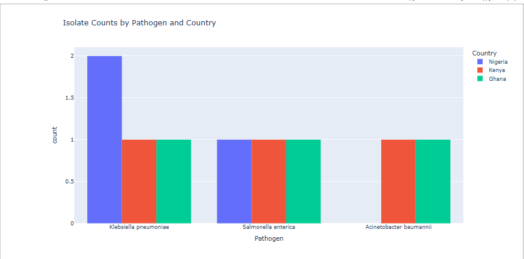
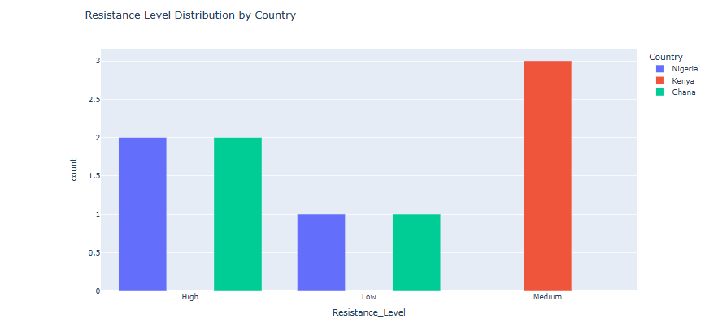
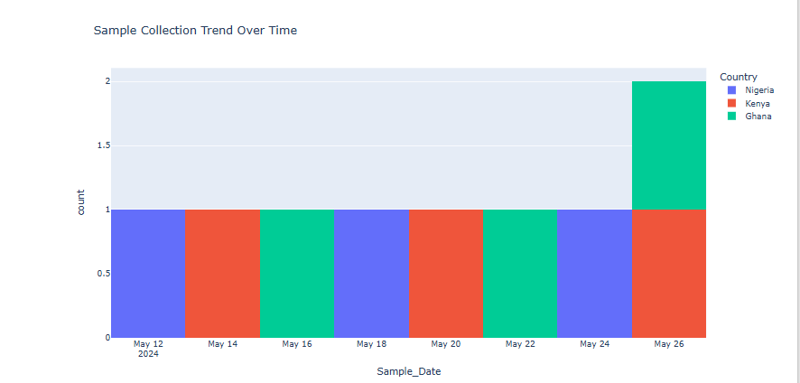

# amr-tracker-lite
Simulated Genomic Surveillance Dashboard for AMR in Africa

---

## 📂 Sample Data Fields

The `simulated_amr_data.csv` file includes:

- `Country`: Nigeria, Kenya, South Africa  
- `Pathogen`: e.g., *E. coli*, *S. aureus*, *K. pneumoniae*  
- `AMR_Gene`: e.g., blaCTX-M, mecA  
- `Date_Reported`: Simulated weekly dates  
- `Sample_Type`: Blood, Urine, Sputum  

---

## 📈 Visual Preview

> #### 🌍 Country-Wise Resistance Overview

#### 🧪 Resistance Trends Over Time

#### 🧬 Pathogen Breakdown by Drug Class

---

🔗 **[👉 View Full Interactive Notebook on NBViewer](https://nbviewer.org/github/Zuwairanajma/amr-tracker-lite/blob/master/amr_dashboard.ipynb)**

## 💡 Inspiration

This project was built as a fast prototype under mentorship guidance, to support a larger research proposal on **AI-Driven Genomic Surveillance of Drug-Resistant Pathogens in Africa**.

It draws inspiration from:
- Prof. Tulio de Oliveira's genomic work at CERI
- WHO’s GLASS AMR surveillance strategy
- Real-world gaps in cross-border bioinformatics capability in Africa

---

## 🧪 Future Plans

- Integration with real genomic datasets (GISAID/SRA)
- Streamlit-based live dashboard deployment
- Expansion to more African regions

---

## 👩🏽‍💻 Author

**Zuwaira Sadiq**  
Tech-Empowered Economist | Aspiring Bioinformatician  
🔗 [GitHub](https://github.com/Zuwairanajma) | ✉️ juwairiyyasadiq@gmail.com

---

## 📜 License

This project is licensed under the MIT License.  
Feel free to fork, adapt, and build upon it.

---
